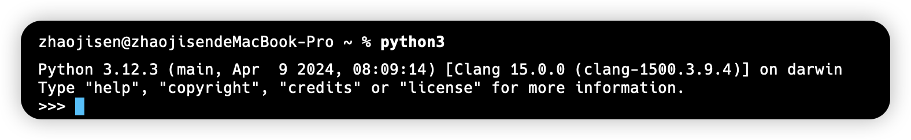
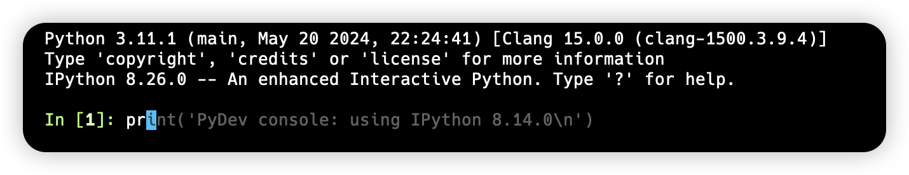

# Python 基础

## 1.注释

Python 中注释主要分为两种，分别是：单行注释 `#` 和多行注释 `"""` 或 `'''`

```python
# 这是一个 print 方法
print()

"""
这是一段注释信息
这是一段注释信息
这是一段注释信息
"""

'''
这是另一段注释信息
这是另一段注释信息
这是另一段注释信息
'''
```

::: tip

注释是不会被 Python 运行的，并且注释应为其开发者描述代码为什么要这么做，而不是描述代码本身

:::

## 2.交互模式

在安装完 Python 解释器后，可以在 Terminal 中开启交互模式进行代码运行，在 Terminal 中输入 python3 将会进入到如下界面（输入 exit 可以退出交互模式）



若想要在交互模式中运行代码，推荐使用 ipython。它是 Python 解释器自带的运行环境的一种升级，要使用 ipython 首先需要下载 ipython 包

```shell
pip install ipython
```

下载后再 Terminal 中输入 `ipython` 即可进入交互模式



## 2.变量与常量

在 Python 中，不论是变量还是常量，都是用于`数据的保存`。在声明时无需使用任何关键字，只需指明变量或常量的名称以及它们的值

```python
# 声明一个变量
num = 10

# 声明一个常量
PI = 3.14159
```

::: details 变量命名规则：

1. Python 中，名称(标识符)只能由：数字、字符、下划线构成，且不能以数字开头
2. 对于普通变量，可使用蛇形命名法，例如 `max_value`
3. Python 语言并没有设置常量，如果想表示当前这个变量不能改变，一般采用全大写字母，用下划线连接，例如 `MAX_CONNERTTIONS`
4. 若变量标记为 "仅内部使用"，则为其追加下划线前缀，例如 `_local_var`
:::

>[!important]注意：
>
> 1. 在 Python 中使用变量前，必须赋值，因为 `Python 变量没有默认值`
> 2. 由于 Python 是一门`动态类型语言`，因此变量可被多次重新赋值，且在声明变量时也无需指定变量类型

### 1.1 注明类型

与 TypeScript 类似，由于动态类型语言在使用变量时可能会导致歧义，因此 Python 也有对应的注解标注方式(Python 3.5 以后)

```python
from typing import String

message: String = 'Hello, world'
```

## 3.数据类型

为了更充分的利用内存空间以及更有效的管理内存，Python 中数据是有不同类型的，且不同的类型定了当前变量在内存中的存储体积。在 Python 中数据类型可分为：

- 数字类型（Number）
- 布尔类型（Boolean）
- 字符串类型（String）
- 列表类型（List）
- 元组类型（Tuple）
- 字典类型（Dictionary）
- 集合类型（Set）

:::info type 方法

可以通过 Python 内置的 `type` 方法来判断一个变量的类型，该类型会以 `class 'type'` 的形式进行展现，其中的 type 会精确到该变量的具体类型，例如：str、int、float 等

:::

### (1). 字符串

Python 中，字符串类型是 str 类型，通过双引号 `""` 或单引号 `''` 来将一段字符扩起

```python
# 单引号扩起
str_data1 = '你好'

# 双引号扩起
str_data2 = "(*´▽｀)ノノ"
```

若想在一个字符串中嵌入进单引号或双引号，那么单引号和双引号必须嵌套使用

```python
str_message1 = '这是嵌入进了 "双引号" 的字符串'
str_message2 = "这是嵌入进了 '单引号' 的字符串"
```

### (2). 整形

Python 中，整形是 int 类型的数值。是没有小数部分的数值，可以是正数、负数或零

```python
# 定义正整数
int_positive_integer = 42

# 定义负整数
int_negative_integer = -7

# 定义零
int_zero = 0
```

### (3). 字符

Python 中，字符类型是 bytes 类型，`用于表示二进制数据序列`，该对象是不可变的字节序列，每个字节的值在 0 到 255 之间。通常用于处理二进制数据，例如文件内容、网络数据或图像数据。

```python
byte_data = b'a'

print(type(byte_data))  # <class 'bytes'> 
```

### (4). 布尔类型

Python 中，布尔类型通过 boolean 表示，该类型的值只有两个，分别是：True 和 False
