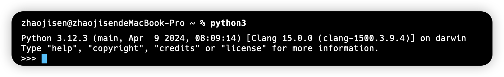
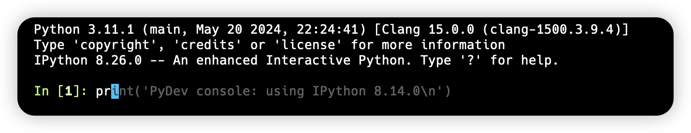

# Python 基础

## 1.注释

Python 中注释主要分为两种，分别是：单行注释 `#` 和多行注释 `"""` 或 `'''`

```python
# 这是一个 print 方法
print()

"""
这是一段注释信息
这是一段注释信息
这是一段注释信息
"""

'''
这是另一段注释信息
这是另一段注释信息
这是另一段注释信息
'''
```

::: tip

注释是不会被 Python 运行的，并且注释应为其开发者描述代码为什么要这么做，而不是描述代码本身

:::

## 2.交互模式

在安装完 Python 解释器后，可以在 Terminal 中开启交互模式进行代码运行，在 Terminal 中输入 python3 将会进入到如下界面（输入 exit 可以退出交互模式）



若想要在交互模式中运行代码，推荐使用 ipython。它是 Python 解释器自带的运行环境的一种升级，要使用 ipython 首先需要下载 ipython 包

```shell
pip install ipython
```

下载后再 Terminal 中输入 `ipython` 即可进入交互模式



## 3.变量与常量

在 Python 中，不论是变量还是常量，都是用于`数据的保存`。在声明时无需使用任何关键字，只需指明变量或常量的名称以及它们的值

```python
# 声明一个变量
num = 10

# 声明一个常量
PI = 3.14159
```

::: details 变量命名规则：

1. Python 中，名称(标识符)只能由：数字、字符、下划线构成，且不能以数字开头
2. 对于普通变量，可使用蛇形命名法，例如 `max_value`
3. Python 语言并没有设置常量，如果想表示当前这个变量不能改变，一般采用全大写字母，用下划线连接，例如 `MAX_CONNERTTIONS`
4. 若变量标记为 "仅内部使用"，则为其追加下划线前缀，例如 `_local_var`
:::

>[!important]注意：
>
> 1. 在 Python 中使用变量前，必须赋值，因为 `Python 变量没有默认值`
> 2. 由于 Python 是一门`动态类型语言`，因此变量可被多次重新赋值，且在声明变量时也无需指定变量类型

### (1). 标识符

`标识符`代指程序中自己创建的变量、常量、自定义函数、自定义类。并且区分大小写，其命名规范与变量的命名规范一致：只能包含数字、字母、下划线，且不能以数字开头

### (2). 关键字

`关键字`是 Python 中定义好的方法和具有特殊含义的单词，通过 Python 提供的 `kwlist` 方法就可以查看所有的关键字

```python
import keyword

print(keyword.kwlist)
```

### (3). 注明类型

与 TypeScript 类似，由于动态类型语言在使用变量时可能会导致歧义，因此 Python 也有对应的注解标注方式(Python 3.5 以后)

```python
from typing import List, Tuple, Dict, Set

# 对于普通的基本类型不需要进行类型的导入
int_num: int = 10
float_num: float = 3.14
types_chart: bytes = b'a'
bool_judgment: bool = True
str_message: str = 'Hello, world'

# 标注列表
def process_items(items: List[int]) -> List[int]:
    return [item * 2 for item in items]

# 标注元组
def get_coordinates() -> Tuple[int, int]:
    return (10, 20)

# 标注字典
def get_person() -> Dict[str, Union[str, int]]:
    return {"name": "Alice", "age": 30}

# 标注集合
def unique_numbers(numbers: Set[int]) -> Set[int]:
    return numbers
```

## 4.数据类型

为了更充分的利用内存空间以及更有效的管理内存，Python 中数据是有不同类型的，且不同的类型定了当前变量在内存中的存储体积。在 Python 中数据类型可分为：

> 数字类型（Number）、布尔类型（Boolean）、字符串类型（String）、字符类型（bytes）<br />
> 列表类型（List）、元组类型（Tuple）、字典类型（Dictionary）、集合类型（Set）

:::info
对于列表类型、元组类型、字典类型、集合类型这四种类型都为`容器类型`，可以存储多个变量。将在后续笔记中记录
:::

:::tip type 方法

可以通过 Python 内置的 `type` 方法来判断一个变量的类型，该类型会以 `class 'type'` 的形式进行展现，其中的 type 会精确到该变量的具体类型，例如：str、int、float 等

:::

### (1). 字符串

Python 中，字符串类型是 str 类型，通过双引号 `""` 或单引号 `''` 来将一段字符扩起

```python
# 单引号扩起
str_data1 = '你好'

# 双引号扩起
str_data2 = "(*´▽｀)ノノ"
```

若想在一个字符串中嵌入进单引号或双引号，那么单引号和双引号必须嵌套使用

```python
str_message1 = '这是嵌入进了 "双引号" 的字符串'
str_message2 = "这是嵌入进了 '单引号' 的字符串"

print(type(str_message1))  # <class 'str'>
```

### (2). 整形

Python 中，整形是 int 类型的数值。是没有小数部分的数值，可以是正数、负数或零

```python
# 定义正整数
int_positive_integer = 42

# 定义负整数
int_negative_integer = -7

# 定义零
int_zero = 0

print(type(int_zero))  # <class 'int'>
```

### (3). 浮点类型

Python 中，浮点型是 float 类型，用于表示小数

```python
float_data1 = 3.14
float_data2 = 0.0

print(type(float_data2))  # <class 'float'>
```

### (4). 字符

Python 中，字符类型是 bytes 类型，`用于表示二进制数据序列`，该对象是不可变的字节序列，每个字节的值在 0 到 255 之间。通常用于处理二进制数据，例如文件内容、网络数据或图像数据。

```python
byte_data = b'a'

print(type(byte_data))  # <class 'bytes'> 
```

### (5). 布尔类型

Python 中，布尔类型通过 bool 表示，该类型的值只有两个，分别是：True 和 False

```python
boo1_1 = True
boo2_1 = False

print(type(boo1_1))   # <class 'bool'>
```

### (6). 类型转换

在 Python 中，类型强制转换（也称为类型转换）是将一种数据类型的值转换为另一种数据类型的过程。Python 提供了多种内置函数来实现类型强制转换，以下是一些常见的类型转换函数及其使用示例：

int()：将其他数据类型转换为整数类型。

python
复制代码
x = "10"
y = int(x)
print(y)  # 输出: 10
print(type(y))  # 输出: <class 'int'>
float()：将其他数据类型转换为浮点数类型。

python
复制代码
x = "10.5"
y = float(x)
print(y)  # 输出: 10.5
print(type(y))  # 输出: <class 'float'>
str()：将其他数据类型转换为字符串类型。

python
复制代码
x = 10
y = str(x)
print(y)  # 输出: "10"
print(type(y))  # 输出: <class 'str'>
bool()：将其他数据类型转换为布尔类型。

python
复制代码
x = 1
y = bool(x)
print(y)  # 输出: True
print(type(y))  # 输出: <class 'bool'>
list()：将其他可迭代对象转换为列表类型。

python
复制代码
x = (1, 2, 3)
y = list(x)
print(y)  # 输出: [1, 2, 3]
print(type(y))  # 输出: <class 'list'>
tuple()：将其他可迭代对象转换为元组类型。

python
复制代码
x = [1, 2, 3]
y = tuple(x)
print(y)  # 输出: (1, 2, 3)
print(type(y))  # 输出: <class 'tuple'>
set()：将其他可迭代对象转换为集合类型。

python
复制代码
x = [1, 2, 2, 3]
y = set(x)
print(y)  # 输出: {1, 2, 3}
print(type(y))  # 输出: <class 'set'>
dict()：将其他适当格式的对象（例如包含键值对的列表或元组）转换为字典类型。

python
复制代码
x = [("name", "Alice"), ("age", 30)]
y = dict(x)
print(y)  # 输出: {'name': 'Alice', 'age': 30}
print(type(y))  # 输出: <class 'dict'>
complex()：将数字或字符串转换为复数类型。

python
复制代码
x = "1+2j"
y = complex(x)
print(y)  # 输出: (1+2j)
print(type(y))  # 输出: <class 'complex'>

int() 转换规则：

字符串：如果字符串表示一个合法的整数（例如 "123"），则可以转换为整数。如果字符串包含小数点、字母或其他非数字字符，则会抛出 ValueError。
python
复制代码
int("123")  # 123
int("123.45")  # ValueError
int("abc")  # ValueError
浮点数：转换为整数时，会直接截断小数部分。
python
复制代码
int(123.45)  # 123
布尔值：True 转换为 1，False 转换为 0。
python
复制代码
int(True)  # 1
int(False)  # 0
其他类型：如果是支持 __int__ 方法的对象，也可以转换为整数。
float() 转换规则：

字符串：如果字符串表示一个合法的浮点数（例如 "123.45"），则可以转换为浮点数。如果字符串包含非法字符，则会抛出 ValueError。
python
复制代码
float("123.45")  # 123.45
float("abc")  # ValueError
整数：整数转换为浮点数会保持数值不变，只是类型改变。
python
复制代码
float(123)  # 123.0
布尔值：True 转换为 1.0，False 转换为 0.0。
python
复制代码
float(True)  # 1.0
float(False)  # 0.0
str() 转换规则：

任何类型：几乎任何类型的数据都可以转换为字符串。
python
复制代码
str(123)  # "123"
str(123.45)  # "123.45"
str(True)  # "True"
bool() 转换规则：

数值：0 和 0.0 转换为 False，其他数值转换为 True。
python
复制代码
bool(0)  # False
bool(123)  # True
bool(0.0)  # False
bool(123.45)  # True
字符串：空字符串 "" 转换为 False，其他字符串转换为 True。
python
复制代码
bool("")  # False
bool("abc")  # True
容器类型（如列表、元组、集合、字典）：空容器转换为 False，非空容器转换为 True。
python
复制代码
bool([])  # False
bool([1, 2, 3])  # True
bool({})  # False
bool({"key": "value"})  # True
list()、tuple()、set()、dict() 转换规则：

可迭代对象：任何可迭代对象（如字符串、列表、元组、集合等）都可以转换为相应的类型。
python
复制代码
list("abc")  # ['a', 'b', 'c']
tuple([1, 2, 3])  # (1, 2, 3)
set([1, 2, 2, 3])  # {1, 2, 3}
dict([("key1", "value1"), ("key2", "value2")])  # {'key1': 'value1', 'key2': 'value2'}
complex() 转换规则：

字符串：如果字符串表示一个合法的复数（例如 "1+2j"），则可以转换为复数。如果字符串包含非法字符，则会抛出 ValueError。
python
复制代码
complex("1+2j")  # (1+2j)
complex("abc")  # ValueError
数值：整数或浮点数可以转换为复数，其中实部为该数值，虚部为 0。
python
复制代码
complex(1)  # (1+0j)
complex(1.5)  # (1.5+0j)

## 5.输出

在 Python 中，如果想要打印出一些数据以便知道具体的数据内容，此时用 `print` 即可

```python
print(变量名)
```

除了变量名，`print` 还可以直接输出：常量以及表达式

```python
print(100)

print(100 + 200 + 300)
```

如果想要一次性输出多个数据，可以用英文逗号 `,` 进行分隔

```python
a = 100
b = 200
c = 300

print(a, b, c)
```

:::tip 补充：
在默认情况下，连续使用多个 print 是会换行进行输出的，这一点可以在 print 的源码中得到具体的体现

```python
# known special case of print
def print(self, *args, sep=' ', end='\n', file=None): 
   """
   Prints the values to a stream, or to sys.stdout by default.
   
     sep
       string inserted between values, default a space.
     end
       string appended after the last value, default a newline.
     file
       a file-like object (stream); defaults to the current sys.stdout.
     flush
       whether to forcibly flush the stream.
   """
   pass
```

可以看到 print 函数的第三个参数 `end` 默认的参数就是换行符 (`\n`) ，因此可以通过显示的传入 end 参数来控制其是否换行

```python
print('Hello', end='------------------------')
print('World')
```

:::

### 5.1 格式化输出

如果想在 print 中动态的输出一个变量的值，在比较老的版本中可以使用占位符的方式：

```python
name: str = 'Anna'
age: int = 17
money: float = 2.173

print('Name is %s, Age is %d. I have %.2f w money' % (name, age, money))
```

其中：`%s` 代表字符串占位符，`%d` 代表整形占位符、`%.2f` 表示小数点后两位 (以此类推，.3 表示保留三位、不加则默认保留 6 位)，且会四舍五入的浮点数占位符

::: details 常用的格式符号：
| Format symbol  | Conversion              | Format symbol  | Conversion               |
| -------------  | :-----------:           | :-----------:  |:-----------:            |
| `%c`           | 字符                     | `%s`          | 字符串                    |
| `%d`           | 有符号十进制整数           | `%u`          | 无符号十进制整数            |
| `%o`           | 八进制整数                | `%x`          | 十六进制整数（小写字母`0x`） |
| `%X`           | 十六进制整数（大写字母`0X`）| `%f`           | 浮点数                    |
| `%e`           | 科学计数法（小写`'e'`）    | `%E`           | 科学计数法（大写`“E”`）     |
| `%g`           | `％f`和`％e`的简写        | `%G`           | `％F`和`％E`的简写         |

:::

:::tip 注意：
在有多个变量存在时，占位符的数量必须与变量的数量一致，并且变量还额外需要使用 `()` 进行包裹
:::

另一种字符串格式化的方式是使用 `f 表达式（Python 3.6 以上）`

```python
print(f'My name is {name} and my age is {age}. I have {money} w money')
```

### 5.2 转义字符

在 Python 中，转义字符用于在字符串中表示一些特殊字符或字符序列，这些字符通常是难以直接输入或具有特殊含义的字符。转义字符以反斜杠 `\` 开头，后跟一个或多个字符，来表示一个特定的字符或序列。

:::details 以下是 Python 中常见的转义字符及其含义：

| Format symbol  | Conversion       | Format symbol  | Conversion  |
| -------------  | :-----------:    | :-----------:  |:-----------:|
| `\\`           | 反斜杠            | `\'`           | 单引号       |
| `\"`           | 双引号            | `\n`           | 换行         |
| `\t`           | 制表符            | `\r`           | 制表符       |
| `\b`           | 退格              | `\f`           | 换页         |
| `\v`           | 垂直制表符         | `\a`           | 响铃         |
| `\0`           | 空字符            |

:::

如果不希望字符串中的转义字符被解释，可以使用`原始字符串（raw string）`。在字符串前加上 r 或 R 前缀即可：

```python
print(r"This is a raw string with a backslash: \\")
```

## 6.输入

在 Python 中，获取键盘输入数据的方法是采用 `input` 函数

```python
password = input("请输入密码:")

print(password)
```

对于用户在键盘中输入的任何内容，`input` 都将其视为字符串

## 7.运算符

在 Python 中，能够实现操作的符号，被称为运算符

:::details 其中包括：

- 算数运算符
- 赋值运算符
- 比较运算符
- 关系运算符
- 逻辑运算符
- 位运算符
- 身份运算符
- 成员运算符
- 三元运算符

:::

### (1). 算数运算符

就是数学中的加减乘除，再次不做赘述。比较特殊的有

| 运算符  | 描述               | 实例               |
| -------------  | :-----------:            | :-----------:            |
| `//`           | 取整除| 返回商的整数部分 `9 // 2`输出结果`4` ,  `9.0 // 2.0`输出结果`4.0` |
| `%`         | 取余| 返回除法的余数 `5 % 2`输出结果`1` |
| `**`           | 指数| `2**3` 为`2`的`3`次方， 输出结果 `8` |

:::tip 需要注意的是：

1. 除法返回的类型是一个浮点类型
2. 数若为 0 将会报错
3. 取整除将不会进行四舍五入，而是会保留小数点

:::

在混合运算时，优先顺序为： `**` 高于 `*` `/` `%` `//` 高于 `+` `-`。因此，为了避免歧义，建议使用 `()` 来处理运算符优先级。

### (2). 赋值运算符

### (3). 复合赋值运算符
