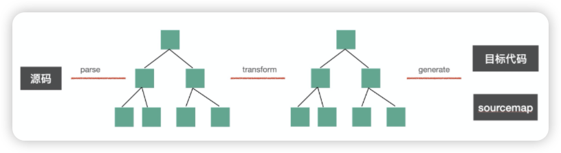

# 编译流程

Babel 是一个`转义器 (Transpiler)`，就是将一种编程语言转换成另一种编程语言。一般主要指从高级语言到低级语言

:::details 高级语言 & 低级语言

- **高级语言**：有很多用于描述逻辑的语言特性，比如分支、循环、函数、面向对象等，接近人的思维，可以让开发者快速的通过它来表达各种逻辑。比如 c++、javascript。

- **低级语言**：与硬件和执行细节有关，会操作寄存器、内存，具体做内存与寄存器之间的复制，需要开发者理解熟悉计算机的工作原理，熟悉具体的执行细节。比如汇编语言、机器语言。

:::

一般编译器 Compiler 是指高级语言到低级语言的转换工具。而从`高级语言到高级语言的转换工具`，被叫做`转换编译器`，简称`转译器 (Transpiler)`。

## 编译流程

babel 是 source to source 的转换，整体编译流程分为三步：

1. parse：通过 parser 把源码转成抽象语法树（AST）
2. transform：遍历 AST，调用各种 transform 插件对 AST 进行增删改
3. generate：把转换后的 AST 打印成目标代码，并生成 sourcemap

### 1. parse

parse 阶段的目的是把源码字符串转换成机器能够理解的 AST，该过程分为**词法分析&语法分析**。

**词法分析**：词法分析会将一段代码，按照单词的构成规则来拆分字符串成单词。 
> 例如，`let name = 'guang'` 这样一段代码，需要先把它分成一个一个不能再细分的单词 (Token)，也就是：`let`，`name`，`=`，`guang` 这种形式

**语法分析**：语法分析会按照不同的语法结构，来把一组单词组合成对象，比如声明语句、赋值表达式等都有对应的 AST 节点。之后把 token 进行递归的组装，生成 AST

### 2. transform

transform 阶段是对 parse 生成的 AST 的处理，会进行 AST 的遍历，遍历的过程中处理到不同的 AST 节点会调用注册的相应的 visitor 函数，visitor 函数里可以对 AST 节点进行增删改，返回新的 AST（可以指定是否继续遍历新生成的 AST）。这样遍历完一遍 AST 之后就完成了对代码的修改。

### 3. generate

generate 阶段会把 AST 打印成目标代码字符串，并且会生成 sourcemap。不同的 AST 对应的不同结构的字符串。比如 `IfStatement` 就可以打印成  `if(test) {}` 格式的代码。这样从 AST 根节点进行递归的字符串拼接，就可以生成目标代码的字符串。
